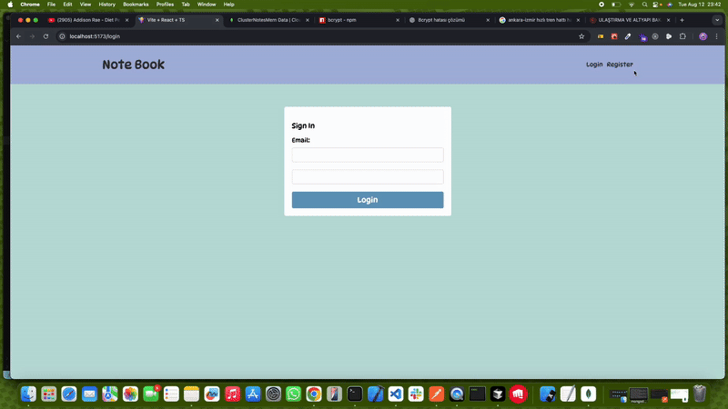

# MERN Not Defteri 📝

Not alma uygulaması - MERN stack (MongoDB, Express.js, React, Node.js) ile geliştirilmiş.

## 🚀 Özellikler

- **Kullanıcı Yönetimi**: Kayıt olma ve giriş yapma
- **Not İşlemleri**: Not ekleme, silme ve görüntüleme
- **Güvenlik**: JWT token tabanlı kimlik doğrulama

## 🛠️ Teknolojiler

### Backend

- Node.js + Express.js
- MongoDB + Mongoose
- JWT Authentication
- bcrypt (şifre hashleme)

### Frontend

- React + TypeScript
- axios
- React router dom
- Vite
- Context API (state management)
- Modern CSS

## 📁 Proje Yapısı

```
mernNotDefteri/
├── backend/          # Express.js API
├── frontend/         # React uygulaması
└── README.md
```

## 🚀 Kurulum

1. **Backend**

   ```bash
   cd backend
   npm install
   npm run server
   ```

2. **Frontend**
   ```bash
   cd frontend
   npm install
   npm run dev
   ```

## 🔧 Gereksinimler

- Node.js
- MongoDB
- `.env` dosyası (backend için)

---

_Ekran GÖrüntüsü_ ✨

